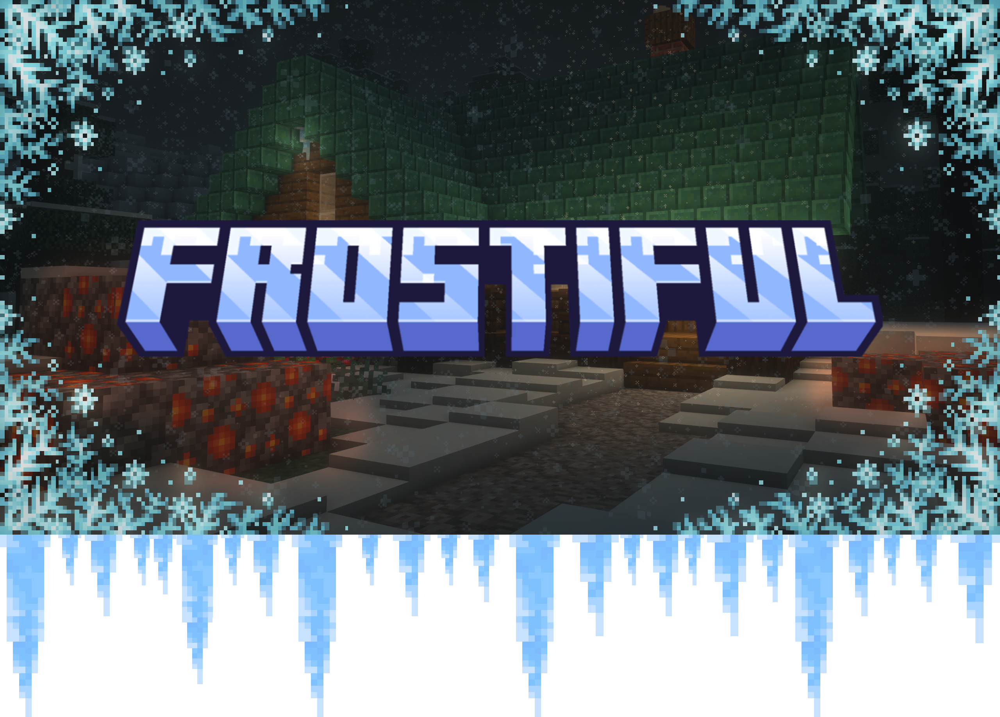

# Frostiful

---

---

*A mod about snow, hypothermia survival, and frost magic.*

[:curseforge:](https://www.curseforge.com/minecraft/mc-mods/frostiful)
[:modrinth:](https://modrinth.com/mod/frostiful)
[:github:](https://github.com/TheDeathlyCow/frostiful)
[:book:](https://modded.wiki/w/Frostiful)

---

Frostiful started in early 2022 as an expansion of the Powder Snow freezing mechanics added with the *Caves & Cliffs Update*. I had explored hypothermia mechanics before in *Minecraft*, primarily through datapacks. The first datapack was for the 2020 Winter "Mini-Season" on an SMP server I help run called Totally Not Suspicious. It featured a basic cold-weather survival system similar to Frostiful's and a map inspired by the Alaskan wilderness. You can still find the source code for this datapack [here](https://github.com/theDeathlyCow/tns-winter)! However, when Powder Snow was added to the game, it gave me the impetus to go further with it and make it into a fully-fledged standalone mod.

I attempted to differentiate Frostiful from other temperature-based survival mods like Tough As Nails or EnvironmentZ by deliberately incorporating its temperature mechanics into the wider world and into adventure. Icicles freeze players who fall on them, which can then be crafted into Glacial Arrows to make freezing itself into a weapon. There is also a new sub-faction of Illagers called the Chillagers who use these arrows as their primary weapon. These Chillagers and their lord, the Frostologer, largely replace vanilla Illagers in snowy biomes, and the player can also embark on a quest to find their castle and take their magic for themselves.

---

<iframe style="width: 75vw; height: 50vh;" src="https://www.youtube-nocookie.com/embed/nXbpWYjgo-Y" title="YouTube video player" frameborder="0" allow="accelerometer; autoplay; clipboard-write; encrypted-media; gyroscope; picture-in-picture; web-share" allowfullscreen></iframe>

---

## LTS Policy

Frostiful is a mod that I have maintained for many years at this point across many different Minecraft versions. While I would love to support this mod as widely as possible, my time is limited. Therefore, I publish this Long-Term Support (LTS) policy to inform users of what versions and loaders I intend to maintain and support. This page is updated regularly, be sure to check back often (especially when asking for support in [my Discord](https://discord.thedeathlycow.com)).

This is my current intended support status for each version of Minecraft that Frostiful is available for. The current LTS policy for Frostiful versions is to fully support the first game drop of the current year. If a patch for that game drop breaks compatibility with Frostiful somehow, then I will only support the latest patch.

Supported versions will receive all new features, fixes, and updates.

Version 1.21.1 will receive limited fixes only support (for things such as minor changes and bug fixes), but no new major features.

Unsupported versions version will receive no future updates, except for critical security fixes.

| Minecraft Version | Support Status                       |
| ----------------- | ------------------------------------ |
| 26.1.x            | ✅ Supported                          |
| 1.21.2-11         | ❌ Unsupported                        |
| 1.21.1            | ⚠️ Fixes only (includes Neoforge[^1]) |
| 1.20.4            | ❌ Unsupported                        |
| 1.20.2            | ❌ Unsupported                        |
| 1.20.1            | ❌ Unsupported                        |
| 1.19.4            | ❌ Unsupported                        |
| 1.19.2            | ❌ Unsupported                        |

[^1]: Frostiful's Neoforge port is very experimental. It is still in alpha, and therefore may contain bugs and cause crashes. The port has also been created in a 'Fabric-like' manner using Forgified Fabric API and custom entry points to minimize the changes needed from the original version, which means that it may not work very well with the Neoforge ecosystem. Proceed with mild caution and please feel free to report issues to the [issue tracker](https://github.com/TheDeathlyCow/frostiful/issues). **Frostiful remains a Fabric-first mod and the Neoforge port is not likely to be updated to new Minecraft versions regularly.**