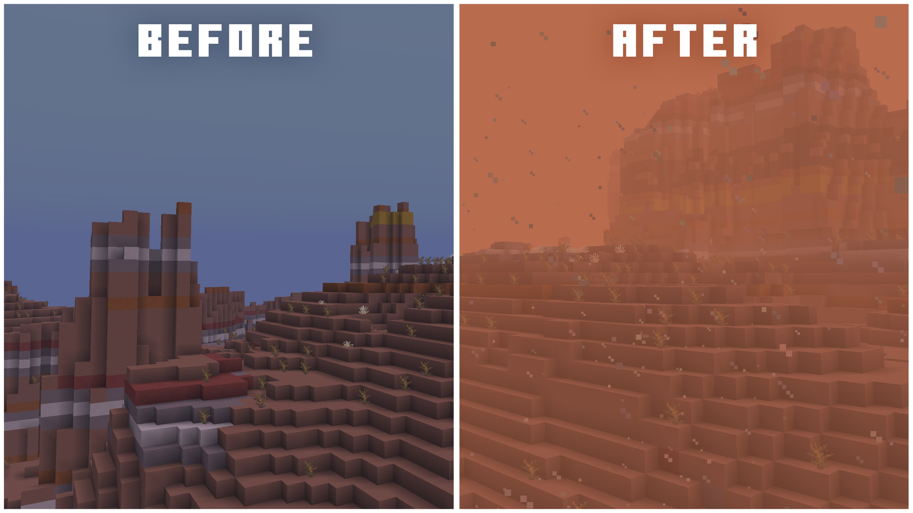
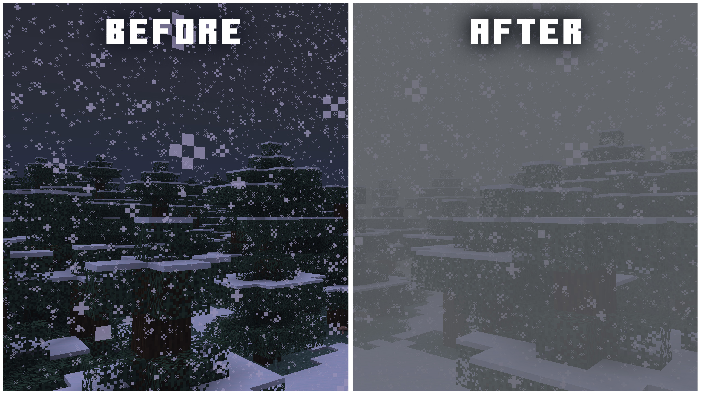
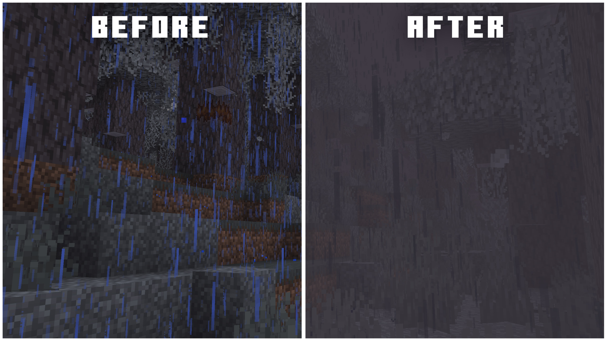
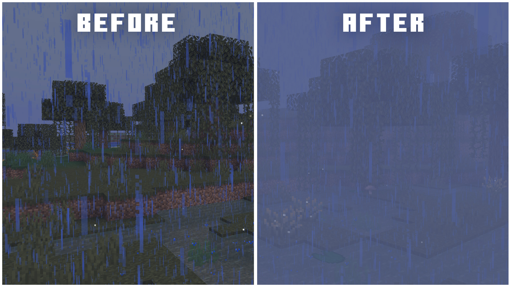

# Immersive Storms

---

=== "Sandstorms"
    

=== "Blizzards"
    

=== "Pale Gardens"
    

=== "Swamps"
    

---

*Immersive fog and weather effects for mountains, deserts, pale gardens, and more!*

[:curseforge:](https://www.curseforge.com/minecraft/mc-mods/immersive-storms)
[:modrinth:](https://modrinth.com/mod/immersive-storms)
[:github:](https://github.com/TheDeathlyCow/immersive-storms)

---

Immersive Storms is a small client-side mod that adds subtle and immersive fog and particle effects to various biomes, based on the weather. It was originally a part of [Scorchful](./scorchful.md), but many players loved the sandstorm effects in Scorchful and wanted to be able to use them standalone without the survival mechanics. Rather than adding a config option to strip out half the mod, I extracted the visuals into a standalone mod that is fully client sided, so it can be used easily anywhere by anyone.

Scorchful still uses Immersive Storms under the hood, embedded directly via jar-in-jar. This means the sandstorm visuals stay consistent between the two mods automatically, and I only have to maintain them in one place. I then built the gameplay features for sandstorms on top of it within Scorchful using visual foundation that Immersive Storms provides.

Once that extraction was done I started adding new weather effects beyond sandstorms. I added blizzards for snowy biomes, fog for swamps, ambient wind particles to mountains and windy biomes, and black rain for the Pale Garden. Pale Gardens in particular I felt still had a bit too much colour coming from the blue tint of vanilla rain that needed to be removed to make it a truly colourless biome.