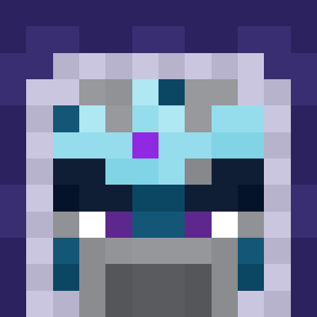
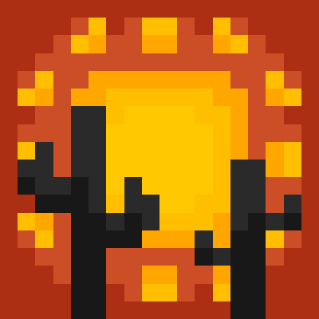
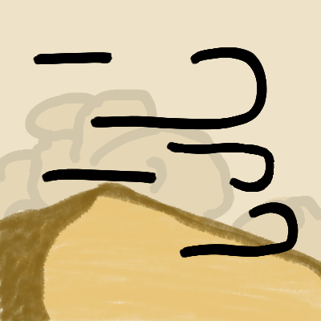
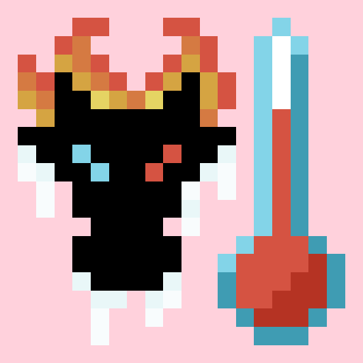
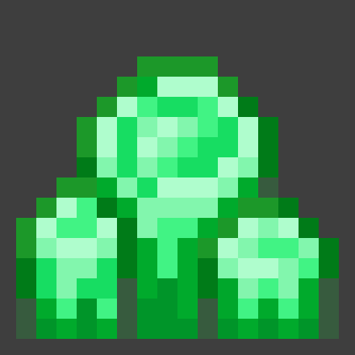
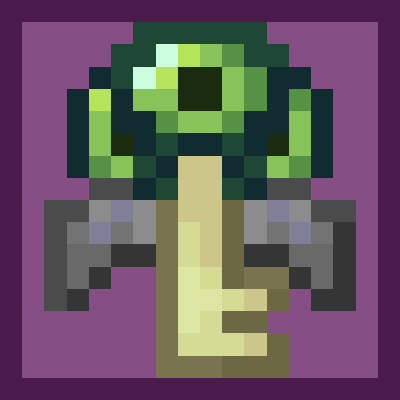

# Hello, I'm TheDeathlyCow!

I'm a software engineer and game developer based in New Zealand. I make a lot of Minecraft mods, mostly focused on the survival aspects of the game. 

[:github: GitHub](https://www.github.com/TheDeathlyCow) | [:bluesky: Bluesky](https://bsky.app/profile/thedeathlycow.bsky.social) | [:discord: Discord](https://discord.thedeathlycow.com) | [:octicons-mail-24: Email](mailto:tns.thedeathlycow@gmail.com)

## Minecraft Mods

  <a href="./frostiful" class="project-card">
    
    

      <h3>Frostiful</h3>
      
A mod about snow, hypothermia survival, and frost magic.

    

  </a>

  <a href="./scorchful" class="project-card">
    
    

      <h3>Scorchful</h3>
      
A Dune-inspired mod about heat-based survival and combat.

    

  </a>

  <a href="./immersive-storms" class="project-card">
    
    

      <h3>Immersive Storms</h3>
      
Immersive fog and weather effects for mountains, deserts, pale gardens, and more!

    

  </a>

  <a href="./thermoo" class="project-card">
    
    

      <h3>Thermoo</h3>
      
A library for entity temperature and environment simulation.

    

  </a>

  <a href="./novoatlas" class="project-card">
    
    

      <h3>NovoAtlas</h3>
      
A data-driven image based world generator for Minecraft.

    

  </a>

  <a href="./more-geodes" class="project-card">
    
    

      <h3>More Geodes</h3>
      
Adds more geodes, what did you think?

    

  </a>

  <a href="./vaulted-end" class="project-card">
    
    

      <h3>Vaulted End</h3>
      
A quality of life mod that makes Elytra easier to get in multiplayer.

    

  </a>

