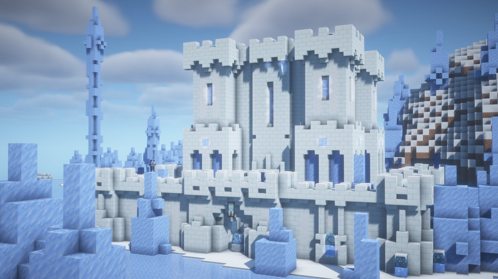
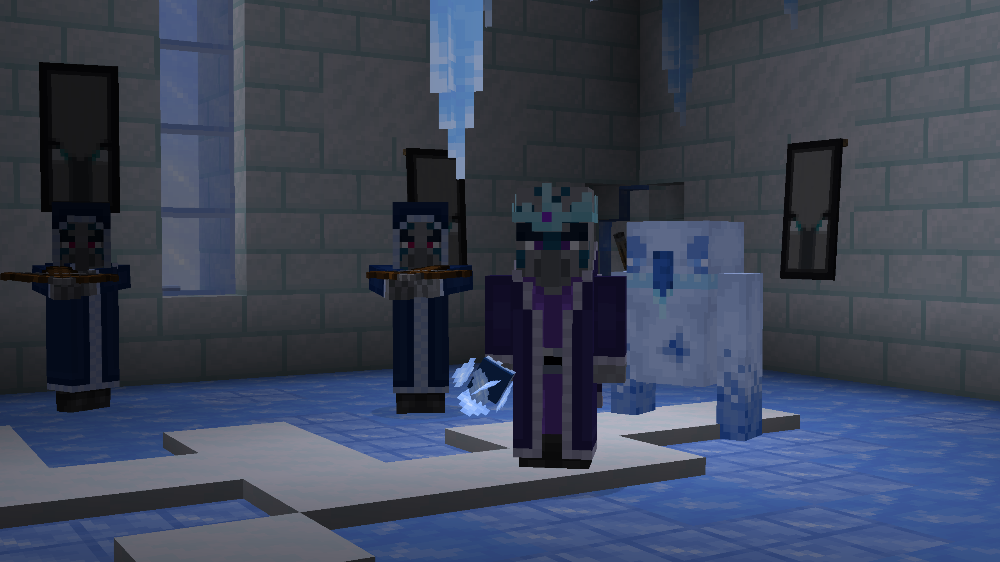
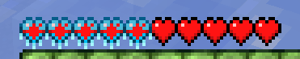
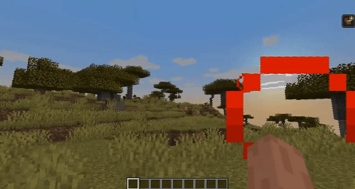
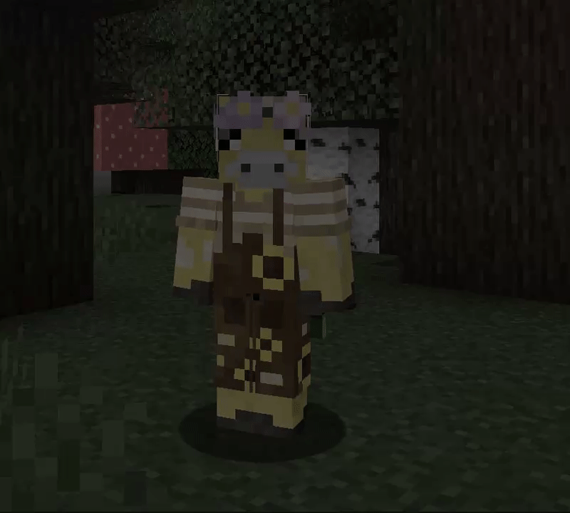
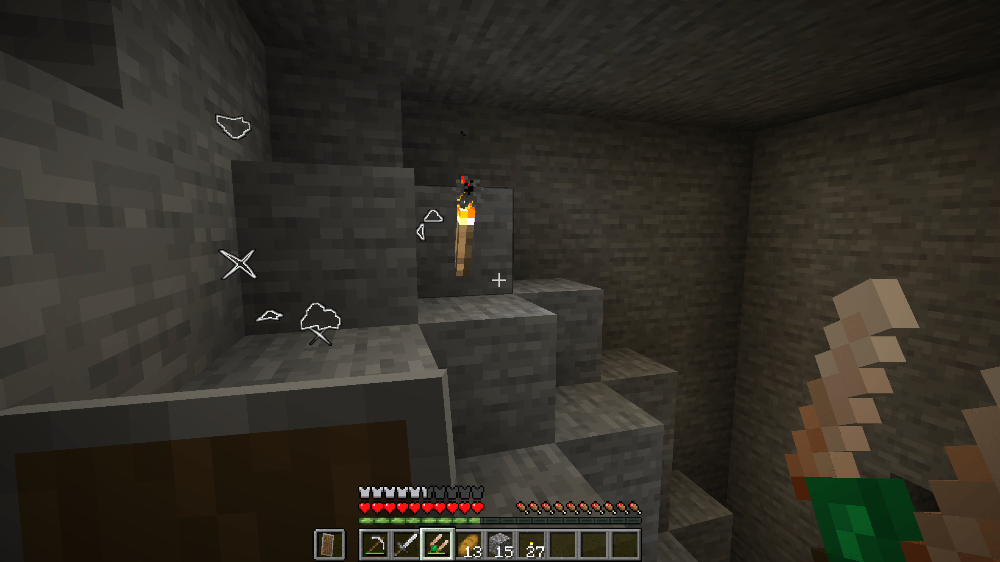

# TheDeathlyCow

## About Me

Hi, I'm Michael (though I go by TheDeathlyCow online). I am currently studying towards a Master's degree in Product Design at the University of Canterbury in Christchurch, New Zealand. I have previously completed a Bachelor of Science degree from UC, having graduated in 2023 majoring in Computer Science with minors in Game Development and Mathematics.

My master's research focuses on generative narrative in role-playing video games, and the role that large language models have to play in the narrative design process. My goal in this research is to find ways to work with AI that ensures that the technology does not overwhelm and replace human developers and designers, and to find ways to preserve the artistic integrity of game narratives in a world where automation increasingly seeks to dominate it. 

I also make mods for *Minecraft: Java Edition*. My mods are primarily based around adding intuitive and interesting survival mechanics to the game. My most popular mod, [Frostiful](#frostiful), has currently amassed a total of 9 million combined downloads across CurseForge and Modrinth. I have been actively developing and supporting this mod, and others, for three years.

## Minecraft Mods

This is an overview of my mods for the game *Minecraft: Java Edition* by Mojang Studios. All of these mods are primarily written in the Java programming language, however I have also created mods in Kotlin as well. My Minecraft mods are primarily published onto the platforms [:curseforge: CurseForge](https://www.curseforge.com/members/thedeathlycow/projects) and [:modrinth: Modrinth](https://modrinth.com/user/TheDeathlyCow), which are more player-centered. I also always publish my source code on my [:github: GitHub account](https://github.com/TheDeathlyCow/).

---

### Frostiful
**Frostiful** is a mod focused on cold-weather survival and magic that I have developed and maintained since February 2022. It was inspired by games such as *Subnautica*, *Subnautica: Below Zero*, and *The Long Dark*, as well as the *Skyrim* mod *Frostfall*. My primary goal was to create a temperature system that is **immersive**, **intuitive**, and **interesting**. I did not want to just create a another tedious layer of difficulty for the player to manage. 

Along the way I have had to take on feedback, run play tests, handle bug reports, review pull requests from the community, provide player and developer support and documentation, ensure inter-mod compatibility, and continuously iterate on new features to make them as fun as possible.

**Technologies used**: Java 21, IntelliJ, Gradle, Git, Photoshop (for textures), Blockbench (for 3D Models and animations), Audacity, Fabric Mod Loader, MediaWiki

=== "Youtube Trailer"
    <center><iframe width="100%" height="500" src="https://www.youtube-nocookie.com/embed/nXbpWYjgo-Y" title="YouTube video player" frameborder="0" allow="accelerometer; autoplay; clipboard-write; encrypted-media; gyroscope; picture-in-picture; web-share" allowfullscreen></iframe></center>

=== "Frostologer's Castle"
    <center markdown>
    <br/> A custom dungeon structure that naturally generates in the world. It is designed to provide an ultimate challenge for players to overcome and gain more power over freezing temperatures. The snow brick blocks that primarily compose this structure were designed specifically for Frostiful.</center>

=== "Custom Monsters"
    <center markdown>
    <br/> **From left to right**: Chillager (Captain), Chillager, Frostologer, Biter. These monsters were created for the Frostologer's Structure. They were based on the Illager class of monsters and drew inspiration from the Iceologer in *Minecraft: Dungeons*. These monsters are meant to integrate temperature into the wider world of Minecraft and make the mechanic a more intentional part of the world, rather than just an afterthought meant solely to increase difficulty.</center>

=== "Temperature HUD"
    <center markdown>
    <br/>The temperature indicator of Frostiful is displayed as a frosty overlay of the vanilla heart bar. As temperature is, in general, not a relevant outside of a select set of cold biomes in the Overworld, it is important to not impose it upon the player when it is not necessary. By displaying temperature in this manner, it balances information with information noise in the HUD. This design is often cited as a highlight of this mod and required many iterations of refinement to achieve.
    </center>

- [:github: GitHub Source](https://www.github.com/TheDeathlyCow/frostiful) 
- [:curseforge: CurseForge Project Page](https://www.curseforge.com/minecraft/mc-mods/frostiful)
- [:modrinth: Modrinth Project Page](https://www.modrinth.com/mod/frostiful)
- [:book: Player Wiki](https://modded.wiki/w/Mod:Frostiful)

---

### Scorchful
**Scorchful** is a mod focused on warm-weather survival and mind control. It is a warm temperature companion mod to [Frostiful](#frostiful) but came with its own set of unique challenges. Hyp**er**thermia is not a common mechanic in video games; and when it is present it is often a very surface level mechanic, such as only requiring players to remove heavy armor when in warm areas. So, I set off to design my own **golden mechanic** for handling cooling that would be just as intuitive and useful as making fire is in Frostiful. My solution was **soaking**. Quite simply: when the player is wet, they will be cooled off. Players can be become wet from simply swimming in rivers or other bodies of water, or by drinking and allowing themselves to **sweat**. This intuitive mechanic has made Scorchful an increasingly popular alternative to many other temperature mods that exist for Minecraft today.

With Scorchful, I also decided to focus on **rendering** effects, such as creating custom post-processing effects for the various temperature effects. This challenged me to delve into Minecraft's **rendering pipelines** and **shader programming**. The effect is a more dynamic and immersive visual experience for the player with a greater sense of "movement" than comparatively simple static images. 

**Technologies used**: Java 21, IntelliJ, Gradle, Git, Photoshop (for textures), Blockbench (for 3D Models and animations), Audacity, Fabric Mod Loader, OpenGL shader language (GLSL)

=== "Title Image"
    <center>[](https://www.curseforge.com/minecraft/mc-mods/scorchful)</center>

=== "Heat Stroke Shader Effect"
    <center>
    <br/>When the player is overheated and dying, they will be given a new status effect called Heat Stroke. Heat Stroke distorts the player's view with a mix of a periodic blur and wobble effect using shaders written in GLSL.</center>

=== "Fear Particles"
    <center>
    <br/>When a player is feared (another new status effect introduced by Scorchful), their screen will be desatured using a GLSL shader, and custom animated bat particles will be displayed around their player model.</center>

- [:github: GitHub Source](https://www.github.com/TheDeathlyCow/scorchful) 
- [:curseforge: CurseForge Project Page](https://www.curseforge.com/minecraft/mc-mods/scorchful)
- [:modrinth: Modrinth Project Page](https://www.modrinth.com/mod/scorchful)
- [:book: Player Wiki](https://modded.wiki/w/Mod:Scorchful)

---

### More Geodes

**More Geodes** is a mod that adds more variety with the Geode feature that was introduced in Minecraft 1.17. It was originally written in Java for the Fabric Mod Loader than ported to Kotlin for the Forge Mod Loader. This mod allows for more resources such as emeralds and quartz to become farmable in a convenient and intuitive way for the player, and improves the caving experience by introducing a Crystal Locator that can be help find these geodes (as well as other treasures). I have maintained this mod off and on since January 2021. Across all platforms and versions, this mod has amassed over 7 million downloads.

**Technologies used**: Java 17, Kotlin, IntelliJ, Gradle, Git, Photoshop (for textures), Blockbench (for 3D Models and animations), Audacity, Fabric Mod Loader, Forge Mod Loader

=== "Emerald Geode"
    <center>
    An Emerald Geode that has been modified by the player to include some Iron Golem guards to protect its riches.</center>

=== "Quartz Geode"
    <center></center>

=== "Crystal Locator"
    <center>
    What it looks like for the player to use a Crystal Locator to help locate a geode underground.</center>

Fabric / Java:

* [:github: GitHub Source](https://www.github.com/TheDeathlyCow/more-geodes)
* [:curseforge: CurseForge Project Page](https://www.curseforge.com/minecraft/mc-mods/emerald-geodes) 
* [:modrinth: Modrinth Project Page](https://www.modrinth.com/mod/more-geodes) 

Forge / Kotlin:

* [:github: GitHub Source](https://www.github.com/TheDeathlyCow/more-geodes-reforged) 
* [:curseforge: CurseForge Project Page](https://www.curseforge.com/minecraft/mc-mods/more-geodes-reforged)
* [:modrinth: Modrinth Project Page](https://www.modrinth.com/mod/more-geodes-reforged)

---
### Thermoo

**Thermoo** is a Java library that provides temperature and environment utilities for [Frostiful](#frostiful), [Scorchful](#scorchful), and other mods. In this project, I have endeavoured to create a powerful and well documented for working with temperature in the context of *Minecraft*, with a robust API covering aspects such as player exposure, environmental conditions, seasons, UI rendering, and more.

**Technologies used**: Java 21, Kotlin, IntelliJ, Gradle, Git, Fabric Mod Loader

!!! Example
    The below JSON file definition is an example of how Frostiful uses Thermoo to define temperature values for freezing climates across various seasons. Environment components use a trait-based framework so that API users may define and use their own parameters seemlessly. The JSON file definition also makes this accessible to configuration by modpack authors, who are typically less technical.

    ??? "Example JSON"
        ```json
        {
            "type": "thermoo:seasonal/temperate",
            "fallback_season": "spring",
            "seasons": {
                "spring": {
                    "type": "thermoo:constant",
                    "components": {
                        "thermoo:temperature": -15.0
                    }
                },
                "summer": {
                    "type": "thermoo:constant",
                    "components": {
                        "thermoo:temperature": -5.0
                    }
                },
                "autumn": {
                    "type": "thermoo:constant",
                    "components": {
                        "thermoo:temperature": -15.0
                    }
                },
                "winter": {
                    "type": "thermoo:constant",
                    "components": {
                        "thermoo:temperature": -25.0
                    }
                }
            }
        }
        ```


- [:github: GitHub Source](https://www.github.com/TheDeathlyCow/thermoo) 
- [:book: Developer Wiki](https://thermoo.thedeathlycow.com/)
- [:curseforge: CurseForge Project Page](https://www.curseforge.com/minecraft/mc-mods/thermoo)
- [:modrinth: Modrinth Project Page](https://www.modrinth.com/mod/thermoo)

---
## Games and Software
I have also created a few other standalone games and software, mostly as assignments for my undergraduate studies at UC.

---

### Space Escape
**Space Escape** is a Unity VR escape room set in outer space. The development process for this game required me to create storyboards for the game narrative and playtest with actual players in VR headsets.

This game was submitted to the Escape Room assignment for the PROD223 course in 2023.

**Technologies used**: Unity, C#, UnityXR, Windows MR, Visual Studio, Git

=== "YouTube Trailer"
    <center><iframe width="100%" height="500" src="https://www.youtube-nocookie.com/embed/8QbxXjPHJwY" title="YouTube video player" frameborder="0" allow="accelerometer; autoplay; clipboard-write; encrypted-media; gyroscope; picture-in-picture; web-share" allowfullscreen></iframe></center>

- [:github: GitHub Source](https://www.github.com/TheDeathlyCow/space-escape)

---

### Calyx C++

**Calyx C++** is a C++ port of a generative grammar library of the same name, originally written in Ruby. This port was commissioned by Fictive Works. This library was designed as a standalone C++ library with Unreal Engine-compatibility in mind. To that end, custom handling for string-types and exceptions had to be created so that integration within Unreal Engine would be as simple as possible. For example, it should be easy to switch out the `std::string` type for Unreal's `FString`. This project involved close collaboration with my client to refine on ideas and ensure I delivered on their requirements. 

**Technologies used**: C++20, XMake, Rider, Git

!!! example
    The below C++ example program will output `Hello world.` 50% of the time, `Hi world.` and `Hey world.` 20% of the time, and `Yo world.` 10% of the time.

    ??? "Example Program"
        ```cpp
        #include <iostream>
        #include <calyx/grammar.h>

        int main(int argc, char *argv[])
        {
            calyx::Grammar grammar = calyx::Grammar();
            calyx::ErrorHolder errors;

            // define the start rule of the grammar
            grammar.start("{greeting} world.", errors);

            // this more C-style manual approach to error checking is to ensure better compatibility with Unreal Engine, which does like C++ exceptions
            if (errors) 
            {
                std::cout << "Error defining grammar: " << errors.getMessage() << std::endl;
                return 1;
            }

            // provide the possible choices for the "greeting" rule of the grammar
            grammar.rule(
                "greeting",
                std::map<calyx::String_t, double> {
                    {"Hello", 5},
                    {"Hi", 2},
                    {"Hey", 2},
                    {"Yo", 1}
                },
                errors
            );
            if (errors) 
            {
                std::cout << "Error defining greeting rule: " << errors.getMessage() << std::endl;
                return 1;
            }

            // Generate a result tree for the grammar
            calyx::Result tree = grammar.generate(errors);
            if (errors) 
            {
                std::cout << "Error generating text: " << errors.getMessage() << std::endl;
                return 1;
            }

            // Print the result text if no errors
            std::cout << tree->getText(grammar.getOptions()) << "\n";

            return 0;
        }
        ```

- [:github: GitHub Source](https://www.github.com/fictiveworks/calyx-cpp)

---
<center markdown>
## Contact Me

[:github: TheDeathlyCow](https://www.github.com/TheDeathlyCow)    

[:bluesky: thedeathlycow.bsky.social](https://bsky.app/profile/thedeathlycow.bsky.social)

:discord: TheDeathlyCow

</center>