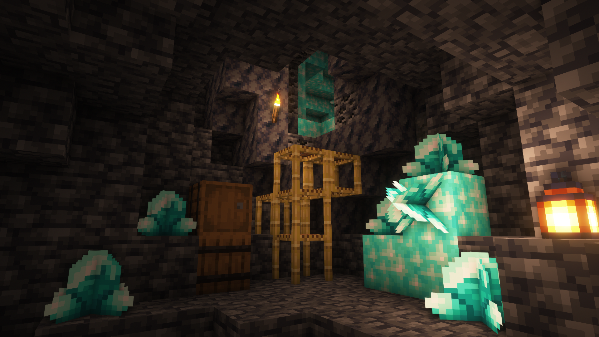
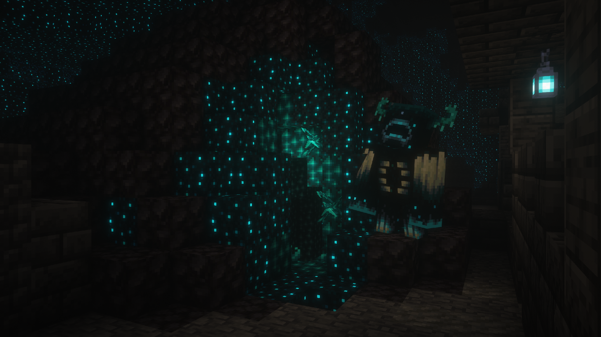
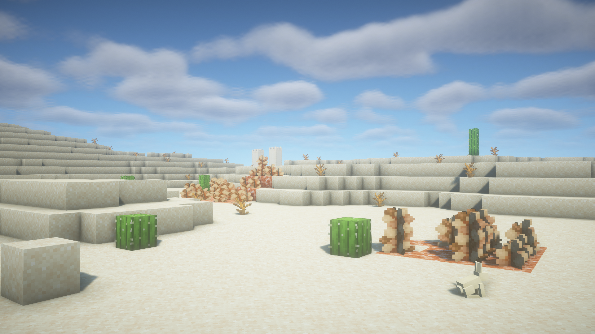

# More Geodes

---

=== "Emerald Geode"
    

=== "Quartz Geode"
    

=== "Lapis Geode"
    

=== "Diamond Geode"
    

=== "Echo Geode"
    

=== "Gypsum Roses"
    

---

*Adds more geodes, what did you think?*

*Fabric Edition*

[:curseforge:](https://www.curseforge.com/minecraft/mc-mods/emerald-geodes)
[:modrinth:](https://modrinth.com/mod/more-geodes)
[:github:](https://github.com/TheDeathlyCow/more-geodes)

*Forge/Neoforge Edition*

[:curseforge:](https://www.curseforge.com/minecraft/mc-mods/more-geodes-reforged)
[:modrinth:](https://modrinth.com/mod/more-geodes-reforged)
[:github:](https://github.com/TheDeathlyCow/more-geodes-reforged)

---

More Geodes is one of my earliest mods, originally released in January 2021. It started with a single idea: Amethyst Geodes were a cool new feature, so what if other minerals generated the same way? The first version added just Emerald Geodes, but it grew quickly to include Quartz, Lapis, Diamonds, Echo Shards, and Gypsum Roses.

I later ported this mod to Forge/Neoforge using Kotlin, which was one of my first explorations into the Kotlin programming language. That is why it is maintained as an entirely separate codebase, which is uncommon for many multiloader mods today.