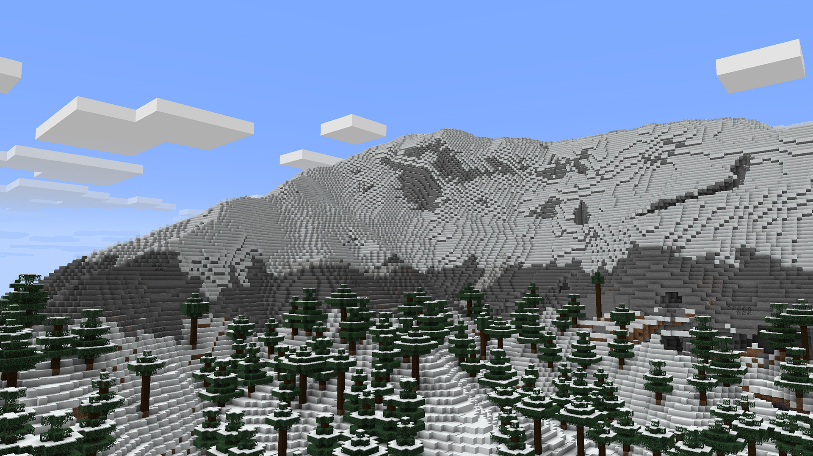

# NovoAtlas

---

---

*A data-driven image based world generator for Minecraft.*

[:curseforge:](https://www.curseforge.com/minecraft/mc-mods/novoatlas)
[:modrinth:](https://modrinth.com/mod/novoatlas)
[:github:](https://github.com/TheDeathlyCow/novoatlas)
[:book:](https://github.com/TheDeathlyCow/novoatlas/wiki)

---

NovoAtlas is a mod that allows you to paint a world's height map and biome map, and then import that to a datapack and allow the Minecraft world generator to fill in the rest of the details. It is a fork of the original [Atlas](https://modrinth.com/mod/atlas), made with their permission under its CC0 license. I made a few contributions to Atlas, but I felt that the changes I wanted to make were substantial enough to warrant a fork. I have used NovoAtlas on my own SMP server, which has been a good real-world testing environment for it as well.

Improvements over the original Atlas include NeoForge support, improved structure-terrain blending, improved underwater cave generation, cave biome maps, and a slightly more ergonomic data format.