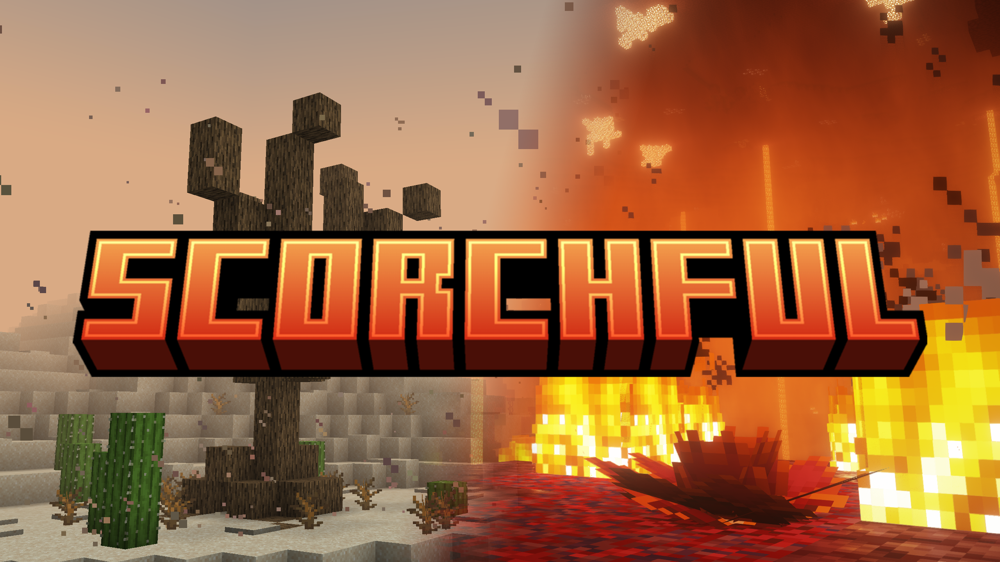

# Scorchful

*A Dune-inspired mod about heat-based survival and combat.*

[:curseforge: **CurseForge**](https://www.curseforge.com/minecraft/mc-mods/scorchful)
[:modrinth: **Modrinth**](https://modrinth.com/mod/scorchful)
[:github: **GitHub**](https://github.com/TheDeathlyCow/scorchful)
[:book: **Wiki**](https://modded.wiki/w/Scorchful)

---

## LTS Policy

Scorchful is a mod that I have maintained for many years at this point across many different Minecraft versions. While I would love to support this mod as widely as possible, my time is limited. Therefore, I publish this LTS policy to inform users of what versions and loaders I intend to maintain and support. This page is updated regularly, be sure to check back often (especially when asking for support in [my Discord](https://discord.thedeathlycow.com)).

This is my current intended support status for each version of Minecraft that Scorchful is available for. The current Long-Term Support (LTS) policy for Scorchful versions is to fully support the first game drop of the current year. If a patch for that game drop breaks compatibility with Scorchful somehow, then I will only support the latest patch.

Supported versions will receive all new features, fixes, and updates.

Version 1.21.1 will receive limited fixes only support (for things such as minor changes and bug fixes), but no new major features.

Unsupported versions version will receive no future updates, except for critical security fixes.

| Minecraft Version | Support Status |
|-------------------|----------------|
| 26.1.x            | ✅ Supported    | 
| 1.21.2-11         | ❌ Unsupported  | 
| 1.21.1            | ⚠️ Fixes only  | 
| 1.20.4            | ❌ Unsupported  | 
| 1.20.2            | ❌ Unsupported  | 
| 1.20.1            | ❌ Unsupported  |
| 1.19.4            | ❌ Unsupported  |
| 1.19.2            | ❌ Unsupported  | 
