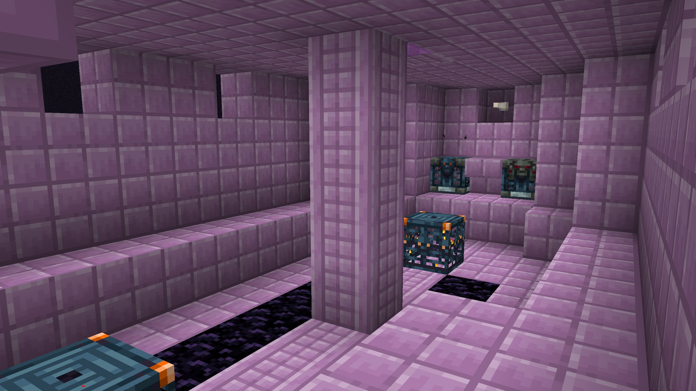

# Vaulted End

---

---

*A quality of life mod that makes Elytra easier to get in multiplayer.*

[:curseforge:](https://www.curseforge.com/minecraft/mc-mods/vaulted-end)
[:modrinth:](https://modrinth.com/mod/vaulted-end)
[:github:](https://github.com/TheDeathlyCow/vaulted-end)

---

Vaulted End is by far my simplest mod: it just replaces the Elytra item frame in the End City Ship with an Elytra vault, and adds some trial spawners to the End City Ship. This allows multiple players to loot the same Ship for Elytra without players being able to individually raid it more than once. The goal here was provide a better multiplayer experience around obtaining Elytra, so players who join a server late do not have to travel thousands of blocks for one. I've used this mod on my SMP server for several seasons now and it has really helped make Elytra more accessible for everyone.

